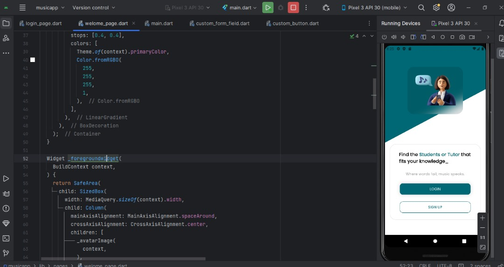
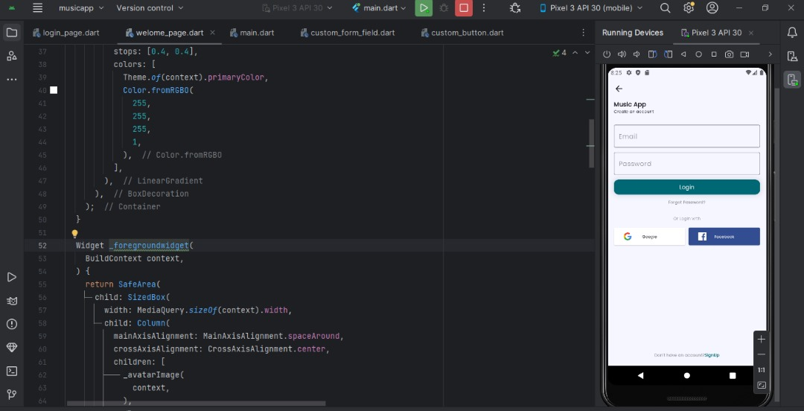

# Welcome and Login Page using Flutter

This project is a simple Flutter application that demonstrates a Welcome and Login page.

## Features

- Welcome screen with a button to navigate to the Login screen.
- Login screen with fields for username and password.
- Basic validation for login fields.
- Navigation between screens.

## Getting Started

These instructions will help you set up and run the project on your local machine.

### Prerequisites

- Flutter SDK: [Install Flutter](https://flutter.dev/docs/get-started/install)
- An IDE with Flutter support (VS Code, IntelliJ, Android Studio)

### Installing

1. Clone the repository:

    ```bash
   https://github.com/Hambugger/FlutterGiraffe.git
    ```

2. Navigate to the project directory:

3. Install the dependencies:

    ```bash
    flutter pub get
    google_fonts
    social_login_buttons
    ```

### Running the App

1. Ensure you have a device connected or an emulator running.
2. Run the app:

    ```bash
    flutter run
    ```

### Main Files
- main.dart: The entry point of the application.
- pages/welcome_page.dart: Contains the UI for the Welcome screen.
- pages/login_page.dart: Contains the UI for the Login screen.
- widgets/custom_button.dart: A reusable button widget.

### Screenshots
- Welcome Screen


- Login Screen


### Built With
Flutter - The framework used.
Dart - The programming language used.

### Authors
Your Name - Hambugger.
